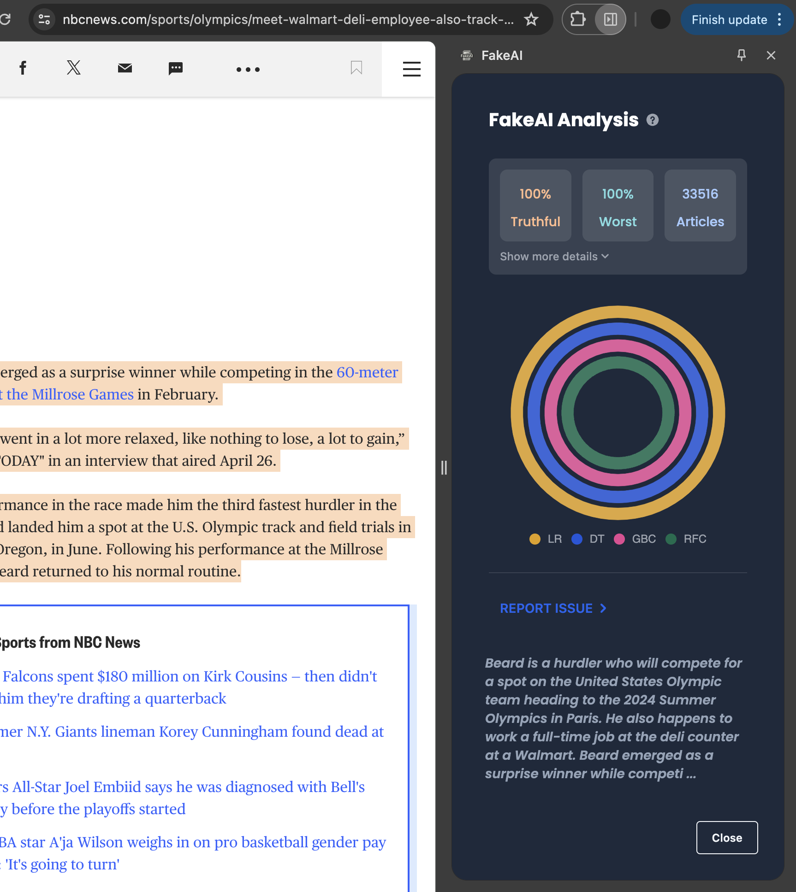

# FakeAI Chrome Extension

A Chrome frontend to send requests the FakeAI Classifier Server.

{width=500}

### Building and installing

The extension requires Tailwind, Alpine.js, and a few other libraries that will be compiled in through webpack. Install all deps through npm, then build to produce a CRX.

    npm install

    # run to build unpacked extension only
    npm run build:local

    # run to build packed and signed extension
    npm run build

This can now be imported into Chrome through the <b>chrome://extensions</b> page, it is suggested to import the extension folder instead of the CRX for development.